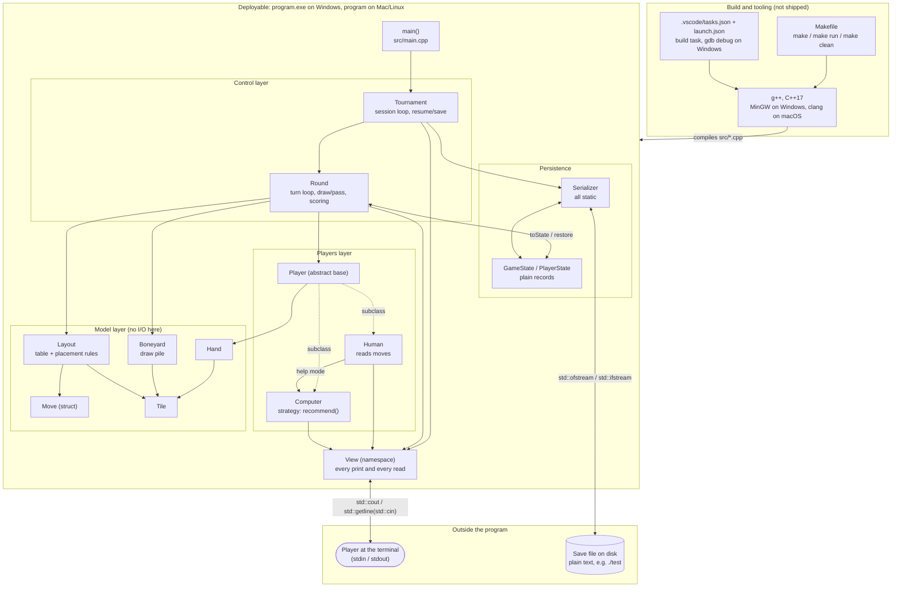
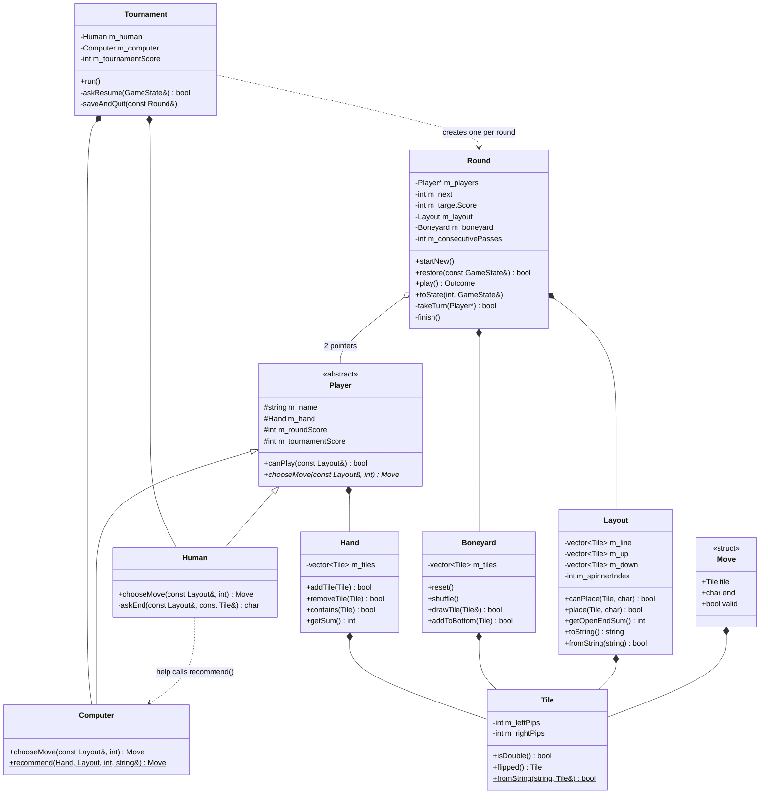
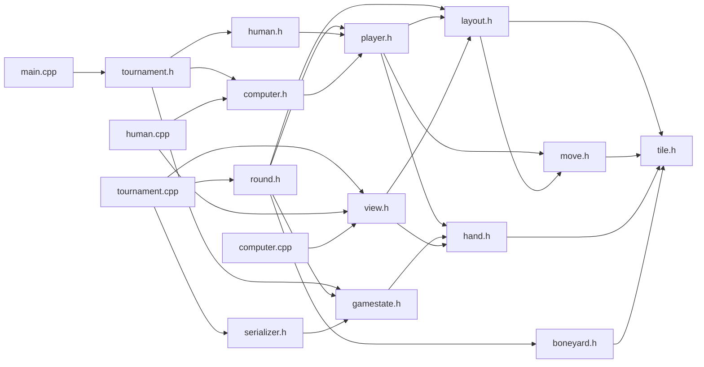

# Architecture

**Short version:** one repository → one C++17 program → one executable (`program`). There are no sub-projects, no shared libraries beyond the C++ standard library, no network calls, and no database. The program touches the outside world in only two ways: **the terminal** (keyboard in, text out) and **text save files** on disk.

## 1. Big picture: layers, deployable, and the outside world

Arrows mean "calls / uses".

**What to notice**

- **Only `View` talks to the terminal.** `Tile`, `Hand`, `Boneyard`, `Layout` and `Move` never print or read. That's the author's main design rule.
- **Only `Serializer` opens files.** `Tournament` is the only class that calls `Serializer`.
- **`Round` never knows which player is which.** It holds two `Player*` pointers and calls `chooseMove()`. `Tournament` is the only class that knows a `Human` and a `Computer` exist.
- **`GameState` sits between `Round` and `Serializer`**, so neither needs to know about the other.

## 2. Who owns whom (class diagram)

Filled diamond (`*--`) = "owns / contains". Open diamond (`o--`) = "points to but doesn't own". Triangle (`<|--`) = "inherits from".

## 3. Header dependencies (who `#include`s whom)

Useful when you add a file or get a compile error about a missing type.

## 4. External services and libraries

| Kind | What's used |
|---|---|
| Third-party libraries | None |
| Standard library | `<iostream>`, `<fstream>`, `<sstream>`, `<string>`, `<vector>`, `<map>`, `<algorithm>`, `<random>`, `<cctype>` |
| Network / APIs / DB | None |
| Randomness | `std::random_device` seeds `std::mt19937` in `Boneyard::shuffle()`, so every new game is different. A resumed game has no randomness until the next round starts |
| Files | Save files, at whatever path the user types, relative to the working directory |
