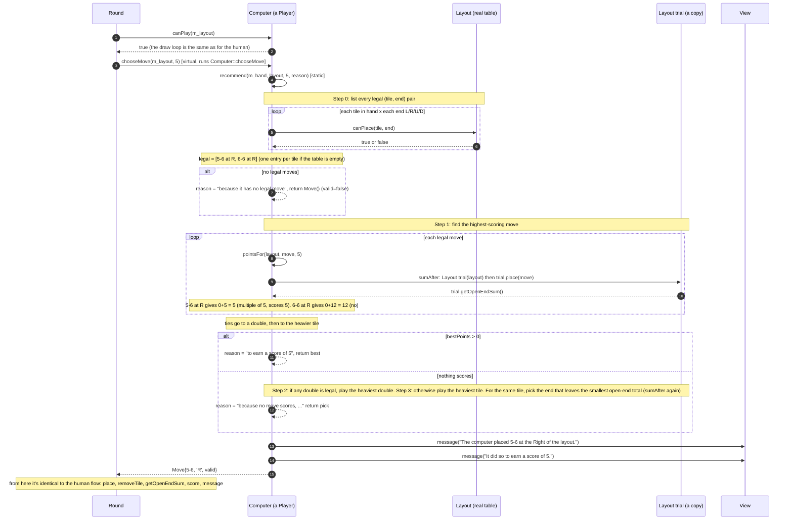
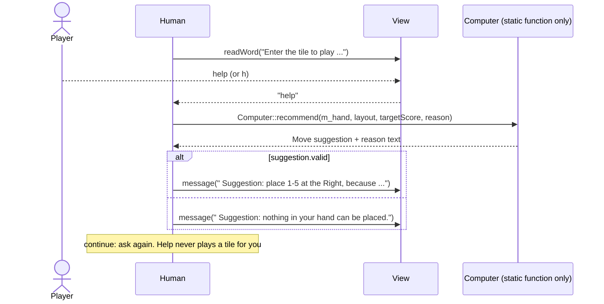

# Secondary workflow: the computer's turn (and help mode)

`Round` treats both players the same way. The only difference is what happens inside `chooseMove()`. For the computer, that's `Computer::recommend()`, the program's only strategy. **Help mode** (the human types `help`) calls the same function, so there's one strategy, not two.

**Real example** (resume the repo's [`test`](../../test) file): table `L 0-4 4-6 R`, target 5, computer hand `1-1 5-6 1-2 6-6 3-4 3-3`. Output:

```
The computer placed 5-6 at the Right of the layout.
It did so to earn a score of 5.
Computer placed 5-6 at the Right. Open-end total is 5, a multiple of 5: 5 points!
```



## Help mode (inside `Human::chooseMove`)



**Things to notice**

- `sumAfter()` copies the `Layout` (`Layout trial(layout);`) and plays on the copy. That's why `Layout` has a hand-written copy constructor, and why the computer "thinking" never changes the real table.
- `recommend()` is `static`: it uses only its parameters, never a `Computer` object's data. That's what lets `Human` call it.
- In help mode, the reason text is written from the computer's point of view ("it played its heaviest tile…"), even though it's shown to the human.
