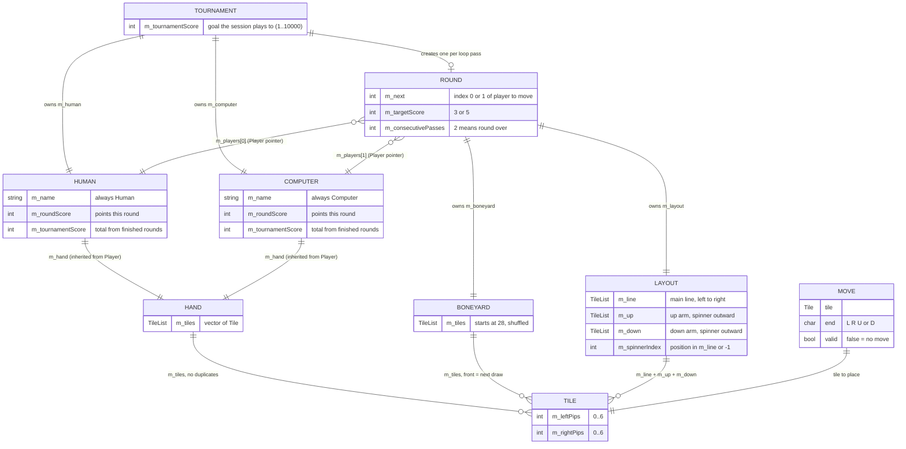
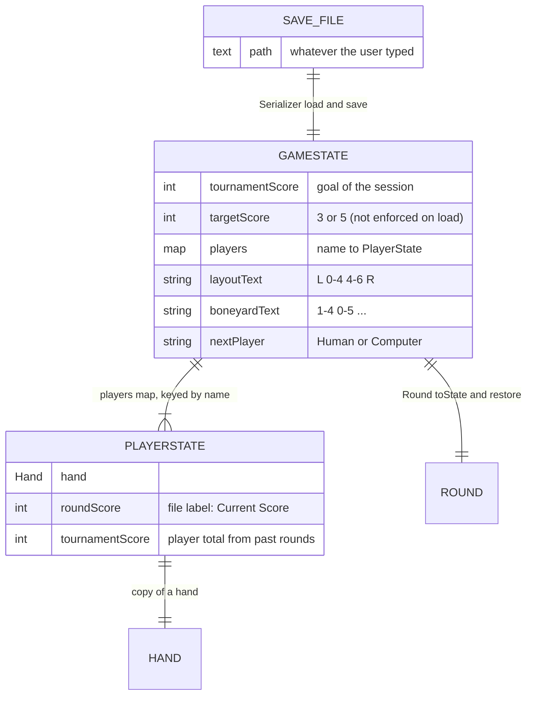

# Data model

**There is no database.** All game data lives in memory as C++ objects while the program runs. The only thing written to disk is a **text save file**. So the "tables" below are really **classes and records**, and the "rows" are objects.

There are two kinds of data classes. Knowing which is which is half of understanding this codebase:

| Kind | Classes | Has rules? | Analogy |
|---|---|---|---|
| **Model objects** (like *entities*) | `Tile`, `Hand`, `Boneyard`, `Layout`, `Player` (+ `Human`, `Computer`), `Move` | **Yes.** They refuse bad changes (duplicate tiles, illegal placements, negative scores) | Entities with business logic |
| **Records** (like *DTOs*: data transfer objects, plain carriers) | `GameState`, `PlayerState` ([gamestate.h](../../src/gamestate.h)) | **No.** Public fields, no checks | DTOs sent between layers |

`Round::toState()` copies model objects into a `GameState` record. `Round::restore()` checks a record and copies it back into model objects. `Serializer` turns records into text and back, and knows nothing about model rules.

## 1. Entities and relationships (in memory)

## 2. Records and the save file

## 3. Save-file format, line by line

Example: the repo's [`test`](../../test) file.

| Save-file line | `GameState` field | Model object it becomes (in `Round::restore`) | Parsed by |
|---|---|---|---|
| `Tournament Score: 7` (outside any player block) | `tournamentScore` | `Tournament::m_tournamentScore` | `Serializer::load` |
| `Target Score: 5` | `targetScore` | `Round::m_targetScore` | `Serializer::load` |
| `Computer:` / `Human:` | starts `players["Computer"]` / `players["Human"]` | matched to `Player::getName()` | `Serializer::load` (a line ending in `:` with no spaces) |
| `   Hand: 1-1 5-6 ...` | `players[name].hand` | `Player::setHand()` | `Serializer::parseHand` → `Tile::fromString` + `Hand::addTile` |
| `   Current Score: 10` | `players[name].roundScore` | `Player::setScores()` | `Serializer::load` |
| `   Tournament Score: 0` (inside a player block) | `players[name].tournamentScore` | `Player::setScores()` | `Serializer::load` |
| `Layout:   L 0-4 4-6 R` | `layoutText` | `Layout` via `Layout::fromString()` (re-orients tiles, finds the spinner) | `Round::restore` |
| `Boneyard:  1-4 0-5 ...` | `boneyardText` | `Boneyard` via `Tile::fromString` + `Boneyard::setTiles()` | `Round::restore` |
| `Next Player: Computer` | `nextPlayer` | `Round::m_next` (0 or 1) | `Round::restore` |

Layout text with a spinner looks like `L 5-3 [D 3-3 U] 3-2 2-2 R`. Everything between `[D` and `U]` is the spinner's group: down-arm tiles (outer to inner), the spinner, then up-arm tiles (inner to outer).

## 4. Rules the data must follow (invariants)

"Invariant" means something that should always be true.

| Rule | Enforced where | Enforced on resume? |
|---|---|---|
| Pips are 0–6 | `Tile::setPips`, `Tile::fromString` | ✅ |
| No duplicate tile within one hand | `Hand::addTile` | ✅ (`parseHand`) |
| No duplicate tile within the boneyard | `Boneyard::addToBottom`, `setTiles` | ✅ |
| Layout tiles connect (touching pips match) | `Layout::place`, `orientChain` | ✅ (`Layout::fromString`) |
| All 28 tiles exist exactly once across hands + layout + boneyard | Only by construction in a fresh round (`Boneyard::reset`, then moving tiles around) | ❌ **Not checked.** A hand-edited file can duplicate or drop tiles (the Day 6 exercise adds this check) |
| Target is 3 or 5 | `Tournament::run` input loop | ❌ Load only checks `> 0` (a file with `Target Score: 4` is accepted; the Day 6 exercise adds this check) |
| Scores are not negative | `Player::addRoundPoints`, `setScores`, `Serializer::load` | ✅ |
| Next player exists | `Serializer::load`, `Round::restore` | ✅ |

## 5. Where each piece of data changes

| Data | Changed by (mutators) |
|---|---|
| `Boneyard::m_tiles` | `reset`, `shuffle`, `drawTile`, `addToBottom`, `setTiles`, `clear` |
| `Hand::m_tiles` (through `Player`) | `Player::addTile/removeTile/setHand/clearHand` |
| `Layout` lists and spinner | `place`, `fromString`, `clear` |
| `Player::m_roundScore` | `addRoundPoints` (turn score + bonus), `setScores`, `finishRound` (reset to 0) |
| `Player::m_tournamentScore` | `finishRound` (adds round score), `setScores` |
| `Round::m_next` | `chooseFirstPlayer`, `play` (alternates), `restore` |
