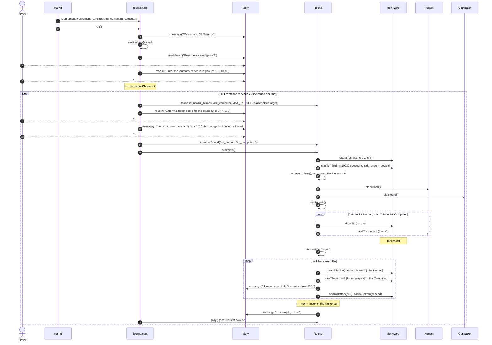

# Secondary workflow: starting a new game and a new round

What happens from launching `./program` (and answering "no" to resume) until the first turn.

**Things to notice**

- The Round is built twice: once with a placeholder target (`MAX_TARGET`), then reassigned with `round = Round(...)` after the player picks one. That works because `Layout` and `Boneyard` define copy assignment.
- `readInt(…, 3, 5)` accepts 4, so a second loop in `Tournament::run` rejects it.
- The first-player draw puts both tiles **back** on the bottom of the boneyard, so the boneyard still has 14 tiles.
- `chooseFirstPlayer` has a fallback (`m_next = 0`) for "boneyard ran out". The comment says it can't happen with 14 tiles, and that's true as long as `HAND_SIZE` stays 7.
