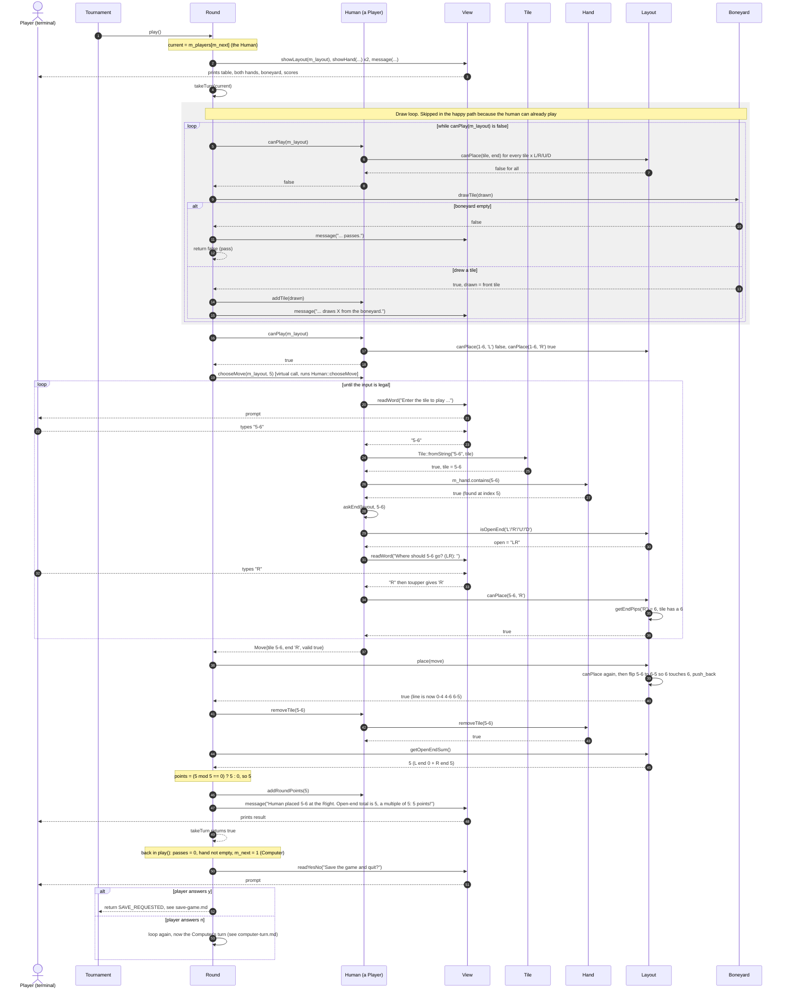

# Request flow: one human turn

The single most important flow in the program is **one turn**: the player types a tile and an end, and the program checks it, places it, scores it, and reports back. The whole program is this flow run in a loop, with `Computer` in place of `Human` every other time.

In web terms: the "UI click" is the player typing `5-6` and `R`, the "controller" is `Round`, the "validation" is `Tile`, `Hand` and `Layout`, and the "database write" is changing the in-memory `Layout`, `Hand` and score. Writing to disk happens only if the player then chooses to save (see [save-game.md](save-game.md)).

**Sample data** comes from [`saves/happy-path.txt`](../saves/happy-path.txt): target 5, table `L 0-4 4-6 R` (open ends L=0, R=6), human hand `1-6 1-5 2-4 3-6 2-2 5-6`. The human types `5-6` then `R`. You can reproduce it exactly:

```sh
make && ./program      # then: y, onboarding/saves/happy-path.txt, 5-6, R
```

## Sequence diagram



## The same flow as a numbered checklist (with file:line)

Line numbers are from the current code and may drift a little.

| # | Where | What happens | Data at this point |
|---|---|---|---|
| 1 | [tournament.cpp:53](../../src/tournament.cpp#L53) `round.play()` | Tournament hands control to the round | `m_targetScore = 5`, `m_next = 0` (Human) |
| 2 | [round.cpp:112–115](../../src/round.cpp#L112-L115) `Round::play` | Pick the current player, print the table, call `takeTurn` | `current` = `&m_human` (seen through a `Player*`) |
| 3 | [round.cpp:182](../../src/round.cpp#L182) → [player.cpp:16](../../src/player.cpp#L16) `Player::canPlay` | Can any tile go anywhere? If not, draw ([boneyard.cpp:99](../../src/boneyard.cpp#L99)) or pass | `true`: `1-6` fits on R |
| 4 | [round.cpp:193](../../src/round.cpp#L193) `player->chooseMove(...)` | Virtual call. C++ runs `Human::chooseMove` because the object is a `Human` | `layout = L 0-4 4-6 R`, `targetScore = 5` |
| 5 | [human.cpp:21](../../src/human.cpp#L21) → [view.cpp:128](../../src/view.cpp#L128) `View::readWord` | Print prompt, read a line, return its first word | `answer = "5-6"` |
| 6 | [human.cpp:35](../../src/human.cpp#L35) → [tile.cpp:63](../../src/tile.cpp#L63) `Tile::fromString` | Must be exactly `digit-digit`, each 0–6 | `tile = {left 5, right 6}` |
| 7 | [human.cpp:39](../../src/human.cpp#L39) → [hand.cpp:58](../../src/hand.cpp#L58) `Hand::contains` | Is it in the hand? (`5-6` and `6-5` count as the same tile) | `indexOf = 5`, so `true` |
| 8 | [human.cpp:43](../../src/human.cpp#L43) → [human.cpp:58](../../src/human.cpp#L58) `Human::askEnd` | List open ends, read a letter, upper-case it | `open = "LR"`, `end = 'R'` |
| 9 | [human.cpp:44](../../src/human.cpp#L44) → [layout.cpp:109](../../src/layout.cpp#L109) `Layout::canPlace` | Does a pip on the tile equal the pips at that end? | `getEndPips('R') = 6`, so `true` |
| 10 | [human.cpp:50](../../src/human.cpp#L50) `return Move(tile, end)` | Package the decision | `Move{5-6, 'R', valid=true}` |
| 11 | [round.cpp:194](../../src/round.cpp#L194) → [layout.cpp:156](../../src/layout.cpp#L156) `Layout::place` | Re-check, flip if needed, append | stored as `6-5`, line = `0-4 4-6 6-5` |
| 12 | [round.cpp:198](../../src/round.cpp#L198) → [hand.cpp:93](../../src/hand.cpp#L93) `Hand::removeTile` | Take it out of the hand | hand = `1-6 1-5 2-4 3-6 2-2` |
| 13 | [round.cpp:199](../../src/round.cpp#L199) → [layout.cpp:75](../../src/layout.cpp#L75) `getOpenEndSum` | Add up open ends | `0 + 5 = 5` |
| 14 | [round.cpp:200–201](../../src/round.cpp#L200-L201) → [player.cpp:45](../../src/player.cpp#L45) | Score if it's a multiple of the target | `5 % 5 == 0`, so `m_roundScore 0 → 5` |
| 15 | [round.cpp:209](../../src/round.cpp#L209) `View::message` | Tell the player | "…Open-end total is 5, a multiple of 5: 5 points!" |
| 16 | [round.cpp:116–134](../../src/round.cpp#L116-L134) | Reset passes, check for empty hand, switch player, offer save | `m_next = 1` (Computer) |

## Validation: who rejects what

| Bad input | Rejected by | Message |
|---|---|---|
| `5_6`, `abc`, `56` | `Tile::fromString` (wrong shape) | "That is not a tile. Type two pip counts joined by a dash, like 2-5." |
| `9-9` | `Tile::fromString` → `Tile::setPips` (out of range 0–6) | same as above |
| `0-0` when you don't hold it | `Hand::contains` | "0-0 is not in your hand." |
| `2-4` on the L end showing 0 | `Layout::canPlace` | "2-4 does not match the 0 at the Left end." |
| `Q` as an end | `Human::askEnd` (not in the open-ends list) | "Please type one of: LR" |
| An illegal move that got past the Human | `Layout::place` returns false in `Round::takeTurn` | "…offered an illegal move and forfeits the turn." (safety net: shouldn't happen) |
