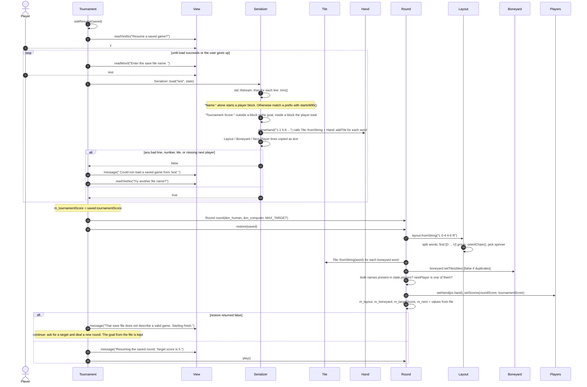

# Secondary workflow: resume a saved game (the "database read")

Loading happens in **two passes**:

1. `Serializer::load` turns text into a `GameState` record. It checks the *format*: numbers are numbers, tiles are tiles, no duplicate in a hand, and the next player has a block.
2. `Round::restore` turns the record into model objects. It checks the *game*: the layout connects, the boneyard has no duplicates, and both players are present.

**Things to notice**

- `restore()` builds a *local* `Layout` and `Boneyard` first, and copies them into the round only after every check passes. So a failed restore leaves the round unchanged. This pattern is called "validate, then commit".
- **Not checked on load:** that all 28 tiles appear exactly once overall (a tile can be in a hand *and* the boneyard), and that the target is 3 or 5 (`Target Score: 4` is accepted and used). Both were confirmed by running the program.
- An empty `Boneyard:` line trims to `"Boneyard:"`, which looks like a player block header ("ends in `:`, no spaces"). So the loader quietly adds a fake player named "Boneyard". It happens to be harmless because `restore()` ignores unknown names, but it's a trap if you change the loader.
