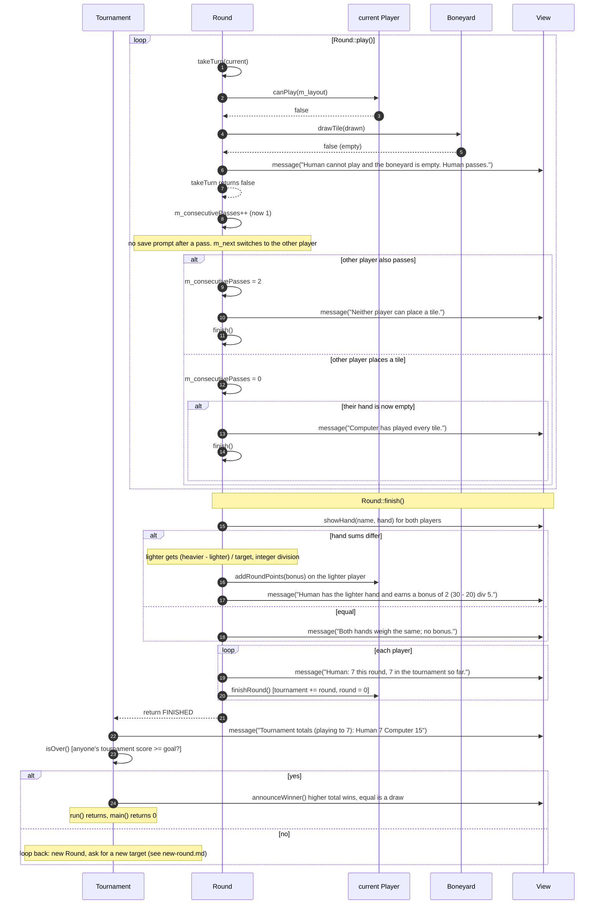

# Secondary workflow: passing, ending a round, and ending the tournament

A round ends in one of two ways:

1. **A player goes out:** they place their last tile.
2. **Blocked:** two passes in a row (`m_consecutivePasses >= PLAYER_COUNT`). A pass happens when a player can't play **and** the boneyard is empty.

Try the blocked path with [`saves/empty-boneyard.txt`](../saves/empty-boneyard.txt): the human can't play and the boneyard is empty, so the human passes straight away.

**Things to notice**

- The bonus uses **integer division**: `(30 - 20) / 5 = 2`, but `(33 - 20) / 5 = 2` as well, not 2.6.
- `finishRound()` moves round points into the tournament total **and** resets the round score. The message line adds the two together *before* calling it, so the printed total is right.
- Ending the tournament uses `>=`. Both players can pass the goal in the same round. Then the higher total wins, or it's a draw.
