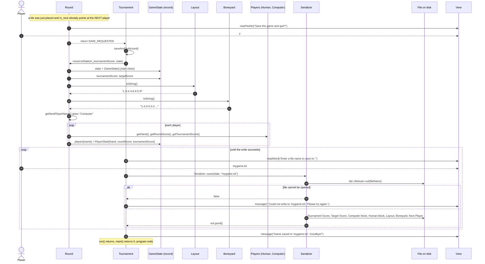

# Secondary workflow: save and quit (the "database write")

After every successful placement, `Round::play()` asks *"Save the game and quit?"*. On `y`, the whole round is copied into a `GameState` record and written to a text file.



**Real output.** Resume [`saves/happy-path.txt`](../saves/happy-path.txt), play `5-6` `R`, then save:

```
Tournament Score: 7

Target Score: 5

Computer:
   Hand: 1-1 0-6 1-2 6-6 3-4 3-3
   Current Score: 10
   Tournament Score: 0

Human:
   Hand: 1-6 1-5 2-4 3-6 2-2
   Current Score: 5
   Tournament Score: 0

Layout:   L 0-4 4-6 6-5 R

Boneyard:  1-4 0-5 0-2 0-0 4-4 5-5 0-1 0-3 4-5 2-6 2-3 1-3 2-5 3-5

Next Player: Computer
```

Notice the human's `5-6` shows up in the layout as **`6-5`**, and `Current Score` went from 0 to 5.

**Things to notice**

- `Serializer::save` always writes **Computer first, then Human** (a hard-coded list of names, to match the course example). If you renamed a player, their block would silently disappear from the file.
- The save prompt appears only after a *placement*. `m_next` has already moved on, so "Next Player" is the player who hasn't moved yet. That's correct.
- Existing files are overwritten without asking.
